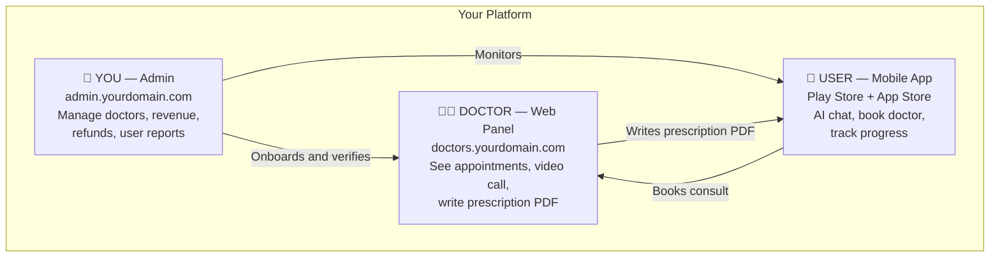
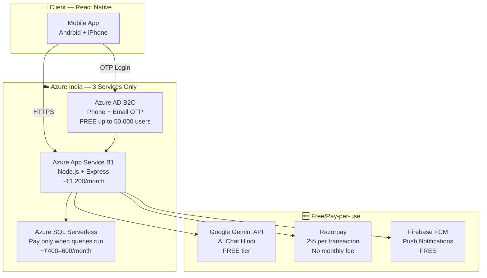
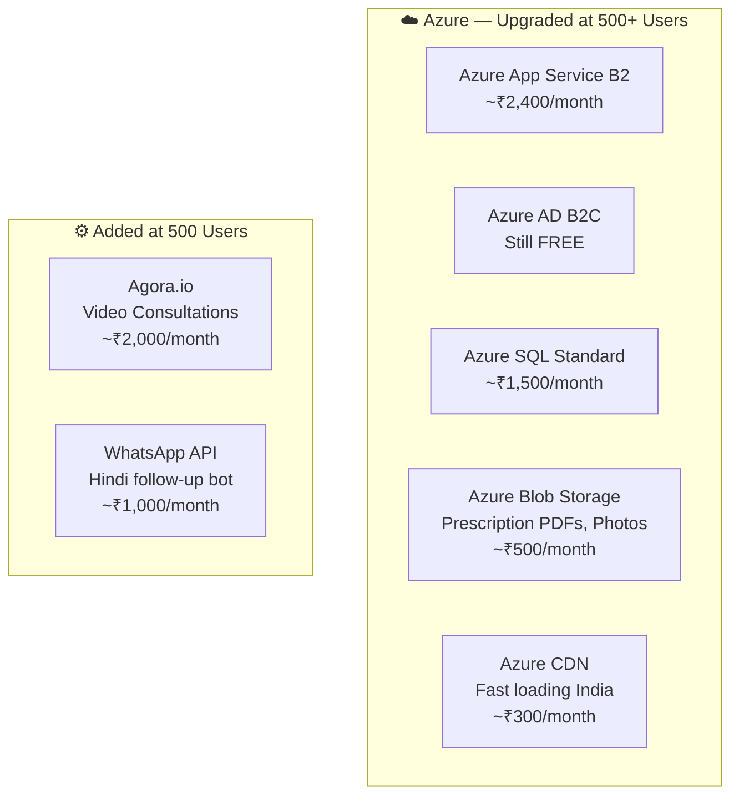
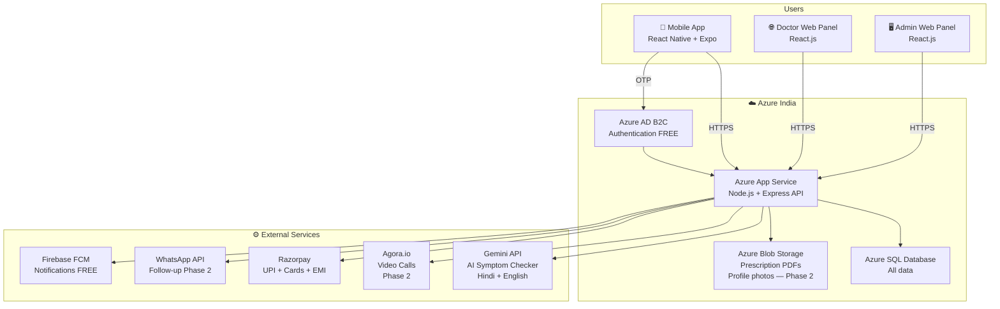
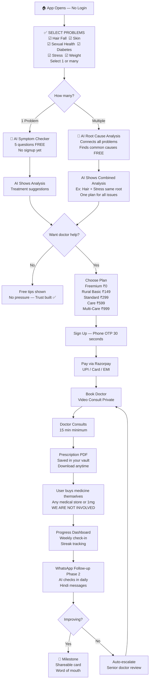
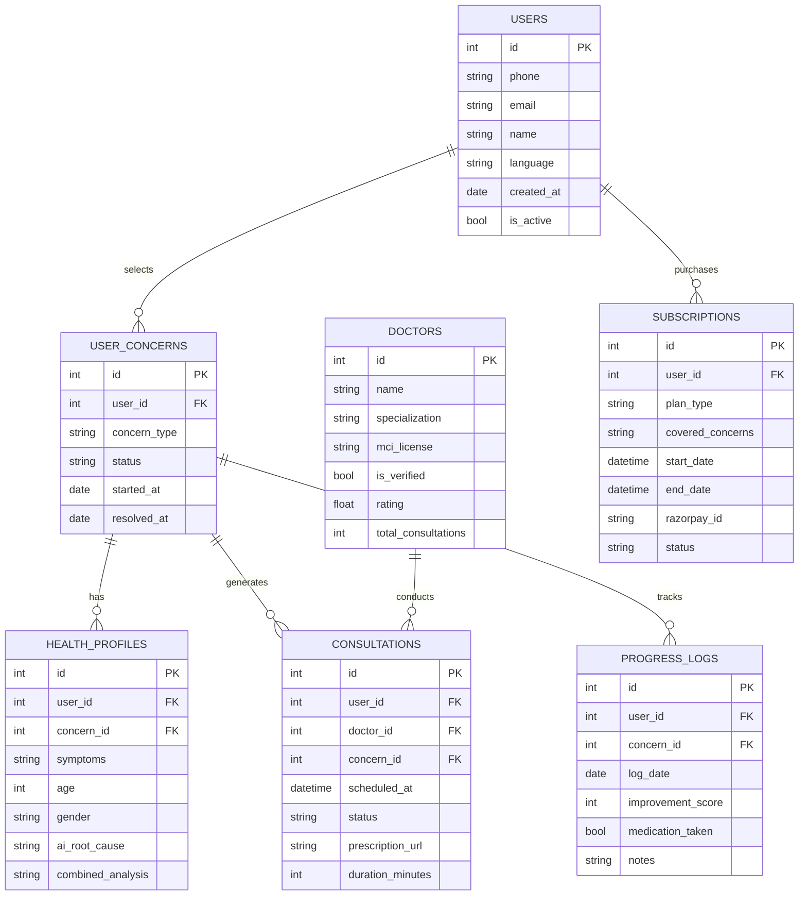
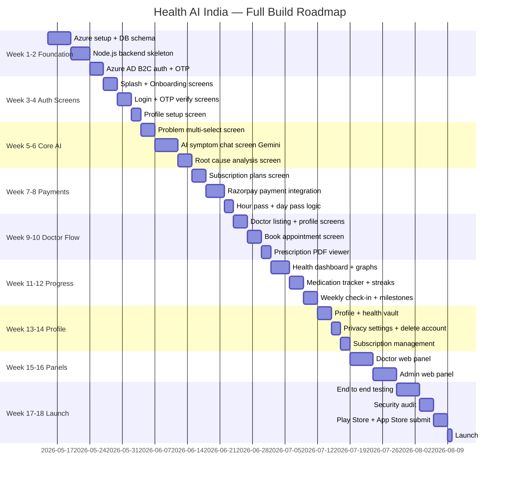

# 🏥 Private Health AI — India
### Built for India | Hindi-first | Private & Secure | Pure Digital Platform

---

## 🎯 Vision

A private, AI-first, Hindi-language health **consultation platform** for Indians dealing with stigmatized health issues — hair fall, sexual health, diabetes, skin problems, mental stress.

**What we provide:**
- AI symptom checker (Hindi + English)
- Licensed doctor video consultations
- Prescription PDF (user takes it to any medical store)
- Progress tracking + streaks
- WhatsApp AI follow-up (Phase 2)

**What we do NOT do:**
- ❌ Sell medicine
- ❌ Deliver anything
- ❌ Run a pharmacy
- ❌ Handle any physical operations

> **"We are the only health app in India that will tell you when you don't need us. Because your health matters more than our revenue."**

---

## 👥 Three Roles in the Platform



### Your Role as Owner (Admin)
| Task | What you do |
|------|------------|
| Onboard doctors | Verify MCI license, create login |
| Monitor revenue | Daily/monthly earnings dashboard |
| Handle refunds | Approve/reject in admin panel |
| Remove bad doctors | Anyone below 3.5 stars gets reviewed |
| Pay doctors | Monthly payout per consultation done |
| Push notifications | Send announcements to all users |

### Doctor Role
- Logs in at `doctors.yourdomain.com` — browser only, no app needed
- Sees today's appointments
- Joins video call with patient
- Writes prescription inside the panel
- Prescription auto-generates PDF saved to patient vault
- Gets paid monthly by you (₹100–150 per consultation)

### User Role
- Downloads app from Play Store / App Store
- Selects health problems (multiple allowed)
- Uses AI symptom checker for free
- Pays to book doctor consultation
- Downloads prescription PDF
- Goes to any medical store or 1mg to buy medicine themselves

---

## 💡 Authentication — Azure AD B2C

| | Firebase Auth | Azure AD B2C |
|--|-------------|-------------|
| **Cost** | Free 10k OTPs/month | ✅ FREE up to 50,000 users/month |
| **Phone OTP** | ✅ Free | ✅ Free |
| **Where data lives** | Google USA servers | ✅ Azure India servers |
| **India DPDP Law** | ❌ Data outside India | ✅ Data stays in India |
| **Azure integration** | Manual setup needed | ✅ Built-in, one portal |
| **Social login** | Google, Facebook | Google, Facebook, Apple |

> **Decision: Azure AD B2C** — Free for 50,000 users, India servers, one portal for everything.

---

## 📦 Two-Phase Build Plan

### Phase 1 — Build and Launch (₹1,600–1,800/month) — 0 to 500 users



| Service | Cost |
|---------|------|
| Azure App Service B1 | ₹1,200/month |
| Azure SQL Serverless | ₹400–600/month |
| Azure AD B2C | ₹0 FREE |
| Gemini AI API | ₹0 FREE tier |
| Razorpay | 2% per transaction only |
| Firebase FCM | ₹0 FREE |
| **Total** | **₹1,600–1,800/month** |

---

### Phase 2 — Scale Up at 500+ users (~₹8,000–10,000/month)



**At 500 paying users x ₹350 avg = ₹1,75,000 revenue — ₹10,000 cost = 94% margin**

---

## 🏗️ Final Architecture (Full Vision)



---

## 👤 User Journey Flow



---

## 💰 Pricing — Final Model

| Plan | Price | Includes | Doctor Consult |
|------|-------|----------|---------------|
| **Freemium** | ₹0 | 3 AI questions/day | ₹199 extra |
| **Pay Per AI** | ₹49/session | Unlimited AI one session | ₹199 extra |
| **Rural Basic** | ₹149/month | AI unlimited | ₹199 extra |
| **Standard** | ₹299/month | AI + tracking + dashboard | ₹199 extra |
| **Care** | ₹599/month | AI + tracking + 1 free consult | ₹149 extra after |
| **Multi-Care** | ₹999/month | All concerns + 2 free consults | ₹149 extra after |
| **Annual Care** | ₹2,499/year | Standard features, best value | ₹149 extra |
| **Extra consult** | ₹199 each | Any plan, pay per visit | — |

### You Never Go in Loss
```
User does 10 consults in a month:
  Revenue: 10 x ₹199 = ₹1,990
  Doctor cost: 10 x ₹150 = ₹1,500
  Your profit: ₹490 always ✅
```

### Profit at Scale

| Paying Users | Avg Revenue/User | Monthly Revenue | Monthly Cost | Profit |
|-------------|-----------------|----------------|-------------|--------|
| 100 | ₹350 | ₹35,000 | ₹5,000 | **₹30,000** |
| 500 | ₹350 | ₹1,75,000 | ₹10,000 | **₹1,65,000** |
| 2,000 | ₹400 | ₹8,00,000 | ₹30,000 | **₹7,70,000** |
| 10,000 | ₹450 | ₹45,00,000 | ₹1,00,000 | **₹44,00,000** |

---

## ⚠️ Risk Mitigation

| Risk | Fix |
|------|-----|
| Too expensive for rural users | Freemium + ₹149 rural plan |
| Users don't trust AI | Never say "diagnosis" — say "health assistant" |
| User cancels after recovery | Maintenance plan ₹99, annual plan |
| Privacy breach | Public trust report, bug bounty ₹5,000 |
| Bad doctor quality | Min 15 min consult, mandatory rating, auto-suspend at 3.5 stars |
| Competitor copies | Moat = Hindi AI trust + user data + community |
| No doctors at launch | Pre-sign 10 doctors on ₹8,000/month retainer |
| Legal complaint | ToS on first use, Pvt Ltd company, doctor indemnity insurance |

---

## 🛠️ Technology Stack

### Phase 1 — Build With This

#### Mobile App
| Technology | Purpose | Cost |
|-----------|---------|------|
| **React Native + Expo** | Android + iPhone one codebase | Free |
| **JavaScript** | One language for app + backend | Free |
| **React Native Paper** | Ready-made UI components | Free |
| **React Navigation** | Move between screens | Free |
| **Zustand** | Store app data in memory while open | Free |
| **AsyncStorage** | Save data on phone permanently (offline) | Free |

#### Backend
| Technology | Purpose | Cost |
|-----------|---------|------|
| **Node.js + Express** | API server | Free |
| **JavaScript** | Same language as app | Free |
| **Azure App Service B1** | Hosting India region | ₹1,200/month |

#### Database and Auth
| Technology | Purpose | Cost |
|-----------|---------|------|
| **Azure SQL Serverless** | All data, pay per use | ₹400–600/month |
| **Azure AD B2C** | Phone OTP + email login | FREE |

#### Free Services
| Technology | Purpose | Cost |
|-----------|---------|------|
| **Google Gemini API** | AI symptom checker Hindi | Free tier |
| **Razorpay** | UPI + cards + EMI + subscriptions | 2% only |
| **Firebase FCM** | Push notifications | Free |

### Phase 2 — Add at 500 Users
| Technology | Purpose | Cost |
|-----------|---------|------|
| **Azure Blob Storage** | Prescription PDFs, photos | ~₹500/month |
| **Azure CDN** | Fast loading across India | ~₹300/month |
| **Agora.io** | Video consultations | ~₹2,000/month |
| **WhatsApp API** | Hindi follow-up messages | ~₹1,000/month |

---

## 📁 Project Folder Structure

```
health-ai-india/
│
├── 📱 mobile/                        # React Native App (User)
│   ├── src/
│   │   ├── screens/
│   │   │   ├── Auth/
│   │   │   │   ├── SplashScreen.js
│   │   │   │   ├── OnboardingScreen.js
│   │   │   │   ├── LoginScreen.js
│   │   │   │   ├── OTPVerifyScreen.js
│   │   │   │   └── ProfileSetupScreen.js
│   │   │   ├── Home/
│   │   │   │   ├── HomeScreen.js
│   │   │   │   └── ProblemSelectScreen.js
│   │   │   ├── AI/
│   │   │   │   ├── SymptomChatScreen.js
│   │   │   │   └── RootCauseScreen.js
│   │   │   ├── Subscription/
│   │   │   │   ├── PlansScreen.js
│   │   │   │   └── PaymentScreen.js
│   │   │   ├── Doctor/
│   │   │   │   ├── DoctorListScreen.js
│   │   │   │   ├── DoctorProfileScreen.js
│   │   │   │   ├── BookAppointmentScreen.js
│   │   │   │   ├── VideoConsultScreen.js
│   │   │   │   └── PrescriptionViewerScreen.js
│   │   │   ├── Progress/
│   │   │   │   ├── DashboardScreen.js
│   │   │   │   ├── MedicationTrackerScreen.js
│   │   │   │   ├── WeeklyCheckInScreen.js
│   │   │   │   └── MilestoneScreen.js
│   │   │   └── Profile/
│   │   │       ├── ProfileScreen.js
│   │   │       ├── HealthVaultScreen.js
│   │   │       ├── PrivacySettingsScreen.js
│   │   │       ├── DeleteAccountScreen.js
│   │   │       └── SubscriptionManageScreen.js
│   │   ├── components/
│   │   ├── services/
│   │   ├── store/
│   │   └── utils/
│   └── app.json
│
├── 🌐 backend/                       # Node.js API Server
│   ├── src/
│   │   ├── routes/
│   │   │   ├── auth.js
│   │   │   ├── symptoms.js
│   │   │   ├── doctors.js
│   │   │   ├── consultations.js
│   │   │   ├── subscriptions.js
│   │   │   └── progress.js
│   │   ├── middleware/
│   │   │   ├── auth.js
│   │   │   └── rateLimit.js
│   │   ├── models/
│   │   ├── services/
│   │   │   ├── gemini.js
│   │   │   ├── razorpay.js
│   │   │   └── notifications.js
│   │   └── utils/
│   ├── .env.example
│   └── package.json
│
├── 🌐 doctor-panel/                  # Doctor Web Panel (React.js)
│   └── src/
│       ├── Login/
│       ├── AppointmentList/
│       ├── VideoConsult/
│       ├── WritePrescription/
│       └── PatientHistory/
│
├── 🖥️ admin-panel/                   # Admin Web Panel (React.js)
│   └── src/
│       ├── Dashboard/
│       ├── UserManagement/
│       ├── DoctorManagement/
│       ├── RevenueReports/
│       └── RefundManagement/
│
└── 📊 database/
    └── schema.sql
```

---

## 🗄️ Database Schema



---

## 🚀 Build Roadmap



---

## 🔒 Security Checklist

- [ ] All API calls use HTTPS only
- [ ] JWT tokens expire in 24 hours
- [ ] Phone OTP verified before any data access
- [ ] All medical data encrypted at rest (Azure SQL TDE)
- [ ] Prescription PDFs encrypted in Azure Blob (Phase 2)
- [ ] Rate limiting on all endpoints
- [ ] No medical data in server logs
- [ ] User can delete all their data in one tap
- [ ] Terms of service accepted before first use
- [ ] AI responses always show "Not a medical diagnosis" disclaimer
- [ ] DPDP Act 2023 compliance
- [ ] Telemedicine Practice Guidelines 2020 compliance
- [ ] Company registered as Private Limited before launch

---

## 💡 Unique Features vs Competitors

| Feature | Man Matters | Bold Care | Practo | Your App |
|---------|------------|-----------|--------|----------|
| Hindi AI chatbot | ❌ | ❌ | ❌ | ✅ |
| Multi-problem selection | ❌ | ❌ | ❌ | ✅ |
| Root cause analysis | ❌ | ❌ | ❌ | ✅ |
| Hour Pass ₹29 | ❌ | ❌ | ❌ | ✅ |
| Freemium model | ❌ | ❌ | ❌ | ✅ |
| Rural plan ₹149 | ❌ | ❌ | ❌ | ✅ |
| Progress dashboard | ❌ | ❌ | ❌ | ✅ |
| Refund if no result | ❌ | ❌ | ❌ | ✅ |
| Data deletion in 1 tap | ❌ | ❌ | ❌ | ✅ |
| Pure platform no medicine | ❌ complex | ❌ complex | ❌ | ✅ simple |

---

## 📦 First Commands to Run

```bash
# Step 1 — Install Expo CLI
npm install -g expo-cli

# Step 2 — Create mobile app
npx create-expo-app health-ai-mobile --template blank

# Step 3 — Create backend
mkdir health-ai-backend
cd health-ai-backend
npm init -y
npm install express cors dotenv helmet express-rate-limit jsonwebtoken mssql @google/generative-ai razorpay

# Step 4 — Create doctor panel
npx create-react-app doctor-panel

# Step 5 — Create admin panel
npx create-react-app admin-panel
```

---

*Built with love for India — Apni baat, apna raaz*
*Pure digital platform. No medicine. No delivery. Just trust.*
